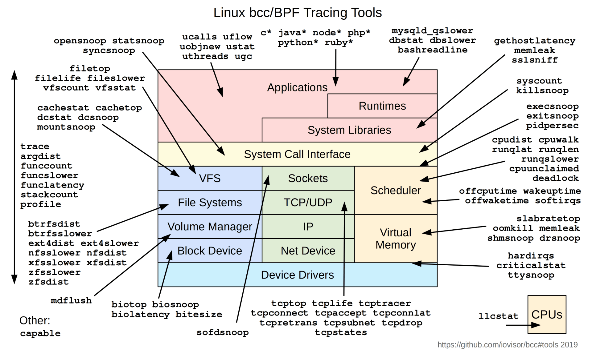
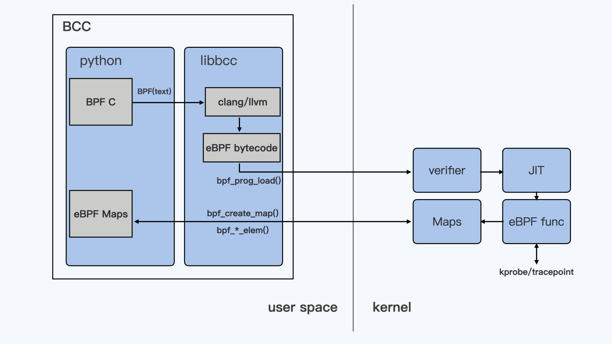

# 加餐06 | BCC：入门eBPF的前端工具
你好，我是程远。

今天是我们专题加餐的最后一讲，明天就是春节了，我想给还在学习的你点个赞。这里我先给你拜个早年，祝愿你牛年工作顺利，健康如意！

上一讲，我们学习了eBPF的基本概念，以及eBPF编程的一个基本模型。在理解了这些概念之后，从理论上来说，你就能自己写出eBPF的程序，对Linux系统上的一些问题做跟踪和调试了。

不过，从上一讲的例子里估计你也发现了，eBPF的程序从编译到运行还是有些复杂。

为了方便我们用eBPF的程序跟踪和调试系统，社区有很多eBPF的前端工具。在这些前端工具中，BCC提供了最完整的工具集，以及用于eBPF工具开发的Python/Lua/C++的接口。那么今天我们就一起来看看，怎么使用BCC这个eBPF的前端工具。

## 如何使用BCC工具

[BCC](https://github.com/iovisor/bcc)（BPF Compiler Collection）这个社区项目开始于2015年，差不多在内核中支持了eBPF的特性之后，BCC这个项目就开始了。

BCC的目标就是提供一个工具链，用于编写、编译还有内核加载eBPF程序，同时BCC也提供了大量的eBPF的工具程序，这些程序能够帮我们做Linux的性能分析和跟踪调试。

这里我们可以先尝试用几个BCC的工具，通过实际操作来了解一下BCC。

大部分Linux发行版本都有BCC的软件包，你可以直接安装。比如我们可以在Ubuntu 20.04上试试，用下面的命令安装BCC：

```shell
# apt install bpfcc-tools

```

安装完BCC软件包之后，你在Linux系统上就会看到多了100多个BCC的小工具 （在Ubuntu里，这些工具的名字后面都加了bpfcc的后缀）：

```shell
# ls -l /sbin/*-bpfcc | more
-rwxr-xr-x 1 root root 34536 Feb  7  2020 /sbin/argdist-bpfcc
-rwxr-xr-x 1 root root  2397 Feb  7  2020 /sbin/bashreadline-bpfcc
-rwxr-xr-x 1 root root  6231 Feb  7  2020 /sbin/biolatency-bpfcc
-rwxr-xr-x 1 root root  5524 Feb  7  2020 /sbin/biosnoop-bpfcc
-rwxr-xr-x 1 root root  6439 Feb  7  2020 /sbin/biotop-bpfcc
-rwxr-xr-x 1 root root  1152 Feb  7  2020 /sbin/bitesize-bpfcc
-rwxr-xr-x 1 root root  2453 Feb  7  2020 /sbin/bpflist-bpfcc
-rwxr-xr-x 1 root root  6339 Feb  7  2020 /sbin/btrfsdist-bpfcc
-rwxr-xr-x 1 root root  9973 Feb  7  2020 /sbin/btrfsslower-bpfcc
-rwxr-xr-x 1 root root  4717 Feb  7  2020 /sbin/cachestat-bpfcc
-rwxr-xr-x 1 root root  7302 Feb  7  2020 /sbin/cachetop-bpfcc
-rwxr-xr-x 1 root root  6859 Feb  7  2020 /sbin/capable-bpfcc
-rwxr-xr-x 1 root root    53 Feb  7  2020 /sbin/cobjnew-bpfcc
-rwxr-xr-x 1 root root  5209 Feb  7  2020 /sbin/cpudist-bpfcc
-rwxr-xr-x 1 root root 14597 Feb  7  2020 /sbin/cpuunclaimed-bpfcc
-rwxr-xr-x 1 root root  8504 Feb  7  2020 /sbin/criticalstat-bpfcc
-rwxr-xr-x 1 root root  7095 Feb  7  2020 /sbin/dbslower-bpfcc
-rwxr-xr-x 1 root root  3780 Feb  7  2020 /sbin/dbstat-bpfcc
-rwxr-xr-x 1 root root  3938 Feb  7  2020 /sbin/dcsnoop-bpfcc
-rwxr-xr-x 1 root root  3920 Feb  7  2020 /sbin/dcstat-bpfcc
-rwxr-xr-x 1 root root 19930 Feb  7  2020 /sbin/deadlock-bpfcc
-rwxr-xr-x 1 root root  7051 Dec 10  2019 /sbin/deadlock.c-bpfcc
-rwxr-xr-x 1 root root  6830 Feb  7  2020 /sbin/drsnoop-bpfcc
-rwxr-xr-x 1 root root  7658 Feb  7  2020 /sbin/execsnoop-bpfcc
-rwxr-xr-x 1 root root 10351 Feb  7  2020 /sbin/exitsnoop-bpfcc
-rwxr-xr-x 1 root root  6482 Feb  7  2020 /sbin/ext4dist-bpfcc
...

```

这些工具几乎覆盖了Linux内核中各个模块，它们可以对Linux某个模块做最基本的profile。你可以看看下面 [这张图](https://github.com/iovisor/bcc/blob/master/images/bcc_tracing_tools_2019.png)，图里把BCC的工具与Linux中的各个模块做了一个映射。



在BCC的github repo里，也有很完整的 [文档和例子](https://github.com/iovisor/bcc/tree/master/examples) 来描述每一个工具。 [Brendan D. Gregg](http://www.brendangregg.com/) 写了一本书，书名叫《BPF Performance Tools》（我们上一讲也提到过这本书），这本书从Linux CPU/Memory/Filesystem/Disk/Networking等角度介绍了如何使用BCC工具，感兴趣的你可以自行学习。

为了让你更容易理解，这里我给你举两个例子。

第一个是使用opensnoop工具，用它来监控节点上所有打开文件的操作。这个命令有时候也可以用来查看某个文件被哪个进程给动过。

比如说，我们先启动opensnoop，然后在其他的console里运行 `touch test-open` 命令，这时候我们就会看到 `touch` 命令在启动时读取到的库文件和配置文件，以及最后建立的“test-open”这个文件。

```shell
# opensnoop-bpfcc
PID    COMM               FD ERR PATH
2522843 touch               3   0 /etc/ld.so.cache
2522843 touch               3   0 /lib/x86_64-linux-gnu/libc.so.6
2522843 touch               3   0 /usr/lib/locale/locale-archive
2522843 touch               3   0 /usr/share/locale/locale.alias
2522843 touch               3   0 /usr/lib/locale/C.UTF-8/LC_IDENTIFICATION
2522843 touch               3   0 /usr/lib/x86_64-linux-gnu/gconv/gconv-modules.cache
2522843 touch               3   0 /usr/lib/locale/C.UTF-8/LC_MEASUREMENT
2522843 touch               3   0 /usr/lib/locale/C.UTF-8/LC_TELEPHONE
2522843 touch               3   0 /usr/lib/locale/C.UTF-8/LC_ADDRESS
2522843 touch               3   0 /usr/lib/locale/C.UTF-8/LC_NAME
2522843 touch               3   0 /usr/lib/locale/C.UTF-8/LC_PAPER
2522843 touch               3   0 /usr/lib/locale/C.UTF-8/LC_MESSAGES
2522843 touch               3   0 /usr/lib/locale/C.UTF-8/LC_MESSAGES/SYS_LC_MESSAGES
2522843 touch               3   0 /usr/lib/locale/C.UTF-8/LC_MONETARY
2522843 touch               3   0 /usr/lib/locale/C.UTF-8/LC_COLLATE
2522843 touch               3   0 /usr/lib/locale/C.UTF-8/LC_TIME
2522843 touch               3   0 /usr/lib/locale/C.UTF-8/LC_NUMERIC
2522843 touch               3   0 /usr/lib/locale/C.UTF-8/LC_CTYPE
2522843 touch               3   0 test-open

```

第二个是使用softirqs这个命令，查看节点上各种类型的softirqs花费时间的分布图 （直方图模式）。

比如在下面这个例子里，每一次timer softirq执行时间在0～1us时间区间里的有16次，在2-3us时间区间里的有49次，以此类推。

在我们分析网络延时的时候，也用过这个softirqs工具，用它来确认timer softirq花费的时间。

```shell
# softirqs-bpfcc -d
Tracing soft irq event time... Hit Ctrl-C to end.
^C

softirq = block
     usecs               : count     distribution
         0 -> 1          : 2        |********************                    |
         2 -> 3          : 3        |******************************          |
         4 -> 7          : 2        |********************                    |
         8 -> 15         : 4        |****************************************|

softirq = rcu
     usecs               : count     distribution
         0 -> 1          : 189      |****************************************|
         2 -> 3          : 52       |***********                             |
         4 -> 7          : 21       |****                                    |
         8 -> 15         : 5        |*                                       |
        16 -> 31         : 1        |                                        |

softirq = net_rx
     usecs               : count     distribution
         0 -> 1          : 1        |********************                    |
         2 -> 3          : 0        |                                        |
         4 -> 7          : 2        |****************************************|
         8 -> 15         : 0        |                                        |
        16 -> 31         : 2        |****************************************|

softirq = timer
     usecs               : count     distribution
         0 -> 1          : 16       |*************                           |
         2 -> 3          : 49       |****************************************|
         4 -> 7          : 43       |***********************************     |
         8 -> 15         : 5        |****                                    |
        16 -> 31         : 13       |**********                              |
        32 -> 63         : 13       |**********                              |

softirq = sched
     usecs               : count     distribution
         0 -> 1          : 18       |******                                  |
         2 -> 3          : 107      |****************************************|
         4 -> 7          : 20       |*******                                 |
         8 -> 15         : 1        |                                        |
        16 -> 31         : 1        |                                        |

```

BCC中的工具数目虽然很多，但是你用过之后就会发现，它们的输出模式基本上就是上面我说的这两种。

第一种类似事件模式，就像opensnoop的输出一样，发生一次就输出一次；第二种是直方图模式，就是把内核中执行函数的时间做个统计，然后用直方图的方式输出，也就是 `softirqs -d` 的执行结果。

用过BCC工具之后，我们再来看一下BCC工具的工作原理，这样以后你有需要的时候，自己也可以编写和部署一个BCC工具了。

## BCC的工作原理

让我们来先看一下BCC工具的代码结构。

因为目前BCC的工具都是用python写的，所以你直接可以用文本编辑器打开节点上的一个工具文件。比如打开/sbin/opensnoop-bpfcc文件（也可在github bcc项目中查看 [opensnoop.py](https://github.com/iovisor/bcc/blob/v0.12.0/tools/opensnoop.py)），这里你可以看到大概200行左右的代码，代码主要分成了两部分。

第一部分其实是一块C代码，里面定义的就是eBPF内核态的代码，不过它是以python字符串的形式加在代码中的。

我在下面列出了这段C程序的主干，其实就是定义两个eBPF Maps和两个eBPF Programs的函数：

```shell
# define BPF program
bpf_text = """
#include <uapi/linux/ptrace.h>
#include <uapi/linux/limits.h>
#include <linux/sched.h>

…

BPF_HASH(infotmp, u64, struct val_t);  //BPF_MAP_TYPE_HASH
BPF_PERF_OUTPUT(events);                   // BPF_MAP_TYPE_PERF_EVENT_ARRAY

int trace_entry(struct pt_regs *ctx, int dfd, const char __user *filename, int flags)
{
…
}

int trace_return(struct pt_regs *ctx)
{
…
}
“””

```

第二部分就是用python写的用户态代码，它的作用是加载内核态eBPF的代码，把内核态的函数trace\_entry()以kprobe方式挂载到内核函数do\_sys\_open()，把trace\_return()以kproberet方式也挂载到do\_sys\_open()，然后从eBPF Maps里读取数据并且输出。

```shell
…
# initialize BPF
b = BPF(text=bpf_text)
b.attach_kprobe(event="do_sys_open", fn_name="trace_entry")
b.attach_kretprobe(event="do_sys_open", fn_name="trace_return")
…
# loop with callback to print_event
b["events"].open_perf_buffer(print_event, page_cnt=64)
start_time = datetime.now()
while not args.duration or datetime.now() - start_time < args.duration:
    try:
        b.perf_buffer_poll()
    except KeyboardInterrupt:
        exit()
…

```

从代码的结构看，其实这和我们上一讲介绍的eBPF标准的编程模式是差不多的，只是用户态的程序是用python来写的。不过这里有一点比较特殊，用户态在加载程序的时候，输入的是C程序的文本而不是eBPF bytecode。

BCC可以这么做，是因为它通过python [BPF()](https://github.com/iovisor/bcc/blob/v0.12.0/src/python/bcc/__init__.py#L342) 加载C代码之后，调用libbcc库中的函数bpf\_module\_create\_c\_from\_string() 把C代码编译成了eBPF bytecode。也就是说，libbcc库中集成了clang/llvm的编译器。

```shell
    def __init__(self, src_file=b"", hdr_file=b"", text=None, debug=0,
            cflags=[], usdt_contexts=[], allow_rlimit=True, device=None):
        """Create a new BPF module with the given source code.
...
            self.module = lib.bpf_module_create_c_from_string(text, self.debug，cflags_array, len(cflags_array), allow_rlimit, device)
...

```

我们弄明白libbcc库的作用之后，再来整体看一下BCC工具的工作方式。为了让你理解，我给你画了一张示意图：



BCC的这种设计思想是为了方便eBPF程序的开发和使用，特别是eBPF内核态的代码对当前运行的内核版本是有依赖的，比如在4.15内核的节点上编译好的bytecode，放到5.4内核的节点上很有可能是运行不了的。

那么让编译和运行都在同一个节点，出现问题就可以直接修改源代码文件了。你有没有发现，这么做有点像把C程序的处理当成python的处理方式。

BCC的这种设计思想虽然有好处，但是也带来了问题。其实问题也是很明显的，首先我们需要在运行BCC工具的节点上必须安装内核头文件，这个在编译内核态eBPF C代码的时候是必须要做的。

其次，在libbcc的库里面包含了clang/llvm的编译器，这不光占用磁盘空间，在运行程序前还需要编译，也会占用节点的CPU和Memory，同时也让BCC工具的启动时间变长。这两个问题都会影响到BCC生产环境中的使用。

## BCC工具的发展

那么我们有什么办法来解决刚才说的问题呢？eBPF的技术在不断进步，最新的BPF CO-RE技术可以解决这个问题。我们下面就来看BPF CO-RE是什么意思。

CO-RE是“Compile Once – Run Everywhere”的缩写，BPF CO-RE通过对Linux内核、用户态BPF loader（libbpf库）以及Clang编译器的修改，来实现编译出来的eBPF程序可以在不同版本的内核上运行。

不同版本的内核上，用CO-RE编译出来的eBPF程序都可以运行。在Linux内核和BPF程序之间，会通过 [BTF](https://www.kernel.org/doc/html/latest/bpf/btf.html)（BPF Type Format）来协调不同版本内核中数据结构的变量偏移或者变量长度变化等问题。

在BCC的github repo里，有一个目录 [libbpf-tools](https://github.com/iovisor/bcc/tree/master/libbpf-tools)，在这个目录下已经有一些重写过的BCC工具的源代码，它们并不是用python+libbcc的方式实现的，而是用到了libbpf+BPF CO-RE的方式。

如果你的系统上有高于版本10的CLANG/LLVM编译器，就可以尝试编译一下libbpf-tools下的工具。这里可以加一个“V=1”参数，这样我们就能清楚编译的步骤了。

```shell
# git remote -v
origin   https://github.com/iovisor/bcc.git (fetch)
origin   https://github.com/iovisor/bcc.git (push)
# cd libbpf-tools/
# make V=1
mkdir -p .output
mkdir -p .output/libbpf
make -C /root/bcc/src/cc/libbpf/src BUILD_STATIC_ONLY=1                             \
                OBJDIR=/root/bcc/libbpf-tools/.output//libbpf DESTDIR=/root/bcc/libbpf-tools/.output/                   \
                INCLUDEDIR= LIBDIR= UAPIDIR=                                  \
                Install
…

ar rcs /root/bcc/libbpf-tools/.output//libbpf/libbpf.a …

…

clang -g -O2 -target bpf -D__TARGET_ARCH_x86                        \
                 -I.output -c opensnoop.bpf.c -o .output/opensnoop.bpf.o &&                      \
llvm-strip -g .output/opensnoop.bpf.o
bin/bpftool gen skeleton .output/opensnoop.bpf.o > .output/opensnoop.skel.h
cc -g -O2 -Wall -I.output -c opensnoop.c -o .output/opensnoop.o
cc -g -O2 -Wall .output/opensnoop.o /root/bcc/libbpf-tools/.output/libbpf.a .output/trace_helpers.o .output/syscall_helpers.o .output/errno_helpers.o -lelf -lz -o opensnoop

…

```

我们梳理一下编译的过程。首先这段代码生成了libbpf.a这个静态库，然后逐个的编译每一个工具。对于每一个工具的代码结构是差不多的，编译的方法也是差不多的。

我们拿opensnoop做例子来看一下，它的源代码分为两个文件。opensnoop.bpf.c是内核态的eBPF代码，opensnoop.c是用户态的代码，这个和我们之前学习的eBPF代码的标准结构是一样的。主要不同点有下面这些。

内核态的代码不再逐个include内核代码的头文件，而是只要include一个“vmlinux.h”就可以。在“vmlinux.h”中包含了所有内核的数据结构，它是由内核文件vmlinux中的BTF信息转化而来的。

```shell
# cat opensnoop.bpf.c | head
// SPDX-License-Identifier: GPL-2.0
// Copyright (c) 2019 Facebook
// Copyright (c) 2020 Netflix
#include "vmlinux.h"
#include <bpf/bpf_helpers.h>
#include "opensnoop.h"

#define TASK_RUNNING 0

const volatile __u64 min_us = 0;

```

我们使用 [bpftool](https://github.com/torvalds/linux/tree/v5.4/tools/bpf/bpftool) 这个工具，可以把编译出来的opensnoop.bpf.o重新生成为一个C语言的头文件opensnoop.skel.h。这个头文件中定义了加载eBPF程序的函数，eBPF bytecode的二进制流也直接写在了这个头文件中。

```shell
bin/bpftool gen skeleton .output/opensnoop.bpf.o > .output/opensnoop.skel.h

```

用户态的代码opensnoop.c直接include这个opensnoop.skel.h，并且调用里面的eBPF加载的函数。这样在编译出来的可执行程序opensnoop，就可以直接运行了，不用再找eBPF bytecode文件或者eBPF内核态的C文件。并且这个opensnoop程序可以运行在不同版本内核的节点上（当然，这个内核需要打开CONFIG\_DEBUG\_INFO\_BTF这个编译选项）。

比如，我们可以把在kernel5.4节点上编译好的opensnoop程序copy到一台kernel5.10.4的节点来运行：

```shell
# uname -r
5.10.4
# ls -lh opensnoop
-rwxr-x--- 1 root root 235K Jan 30 23:08 opensnoop
# ./opensnoop
PID    COMM              FD ERR PATH
2637411 opensnoop         24   0 /etc/localtime
1      systemd           28   0 /proc/746/cgroup

```

从上面的代码我们会发现，这时候的opensnoop不依赖任何的库函数，只有一个文件，strip后的文件大小只有235KB，启动运行的时候，既不不需要读取外部的文件，也不会做额外的编译。

## 重点小结

好了，今天我们主要讲了eBPF的一个前端工具BCC，我来给你总结一下。

在我看来，对于把eBPF运用于Linux内核的性能分析和跟踪调试这个领域，BCC是社区中最有影响力的一个项目。BCC项目提供了eBPF工具开发的Python/Lua/C++的接口，以及上百个基于eBPF的工具。

对不熟悉eBPF的同学来说，可以直接拿这些工具来调试Linux系统中的问题。而对于了解eBPF的同学，也可以利用BCC提供的接口，开发自己需要的eBPF工具。

BCC工具目前主要通过ptyhon+libbcc的模式在目标节点上运行，但是这个模式需要节点有内核头文件以及内嵌在libbcc中的Clang/LLVM编译器，每次程序启动的时候还需要再做一次编译。

为了弥补这个缺点，BCC工具开始向libbpf+BPF CO-RE的模式转变。用这种新模式编译出来的BCC工具程序，只需要很少的系统资源就可以在目标节点上运行，并且不受内核版本的限制。

除了BCC之外，你还可以看一下 [bpftrace](https://github.com/iovisor/bpftrace)、 [ebpf-exporter](https://github.com/cloudflare/ebpf_exporter) 等eBPF的前端工具。

bpftrace提供了类似awk和C语言混合的一种语言，在使用时也很类似awk，可以用一两行的命令来完成一次eBPF的调用，它能做一些简单的内核事件的跟踪。当然它也可以编写比较复杂的eBPF程序。

ebpf-exporter可以把eBPF程序收集到的metrics以 [Prometheus](https://prometheus.io/docs/introduction/overview/) 的格式对外输出，然后通过 [Grafana](https://grafana.com/) 的dashboard，可以对内核事件做长期的以及更加直观的监控。

总之，前面提到的这些工具，你都可以好好研究一下，它们可以帮助你对容器云平台上的节点做内核级别的监控与诊断。

## 思考题

这一讲的最后，我给你留一道思考题吧。

你可以动手操作一下，尝试编译和运行BCC项目中 [libbpf-tools](https://github.com/iovisor/bcc/tree/master/libbpf-tools) 目录下的工具。

欢迎你在留言区记录你的心得或者疑问。如果这一讲对你有帮助，也欢迎分享给你的同事、朋友，和他一起学习进步。